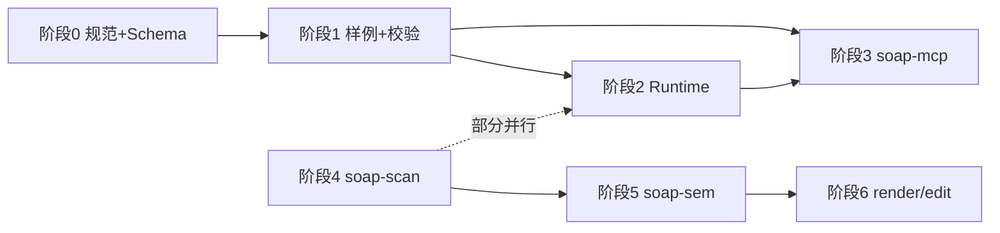

# SOAP 工作计划：空间智能体时代的 HTTP

**目标**：把 **SOAP** 做成「Agent 进入真实 3D 世界」时默认会遇到的**开放契约**——像 HTTP 之于浏览器与服务端；**`soap-mcp`** 是第一张社交名片（MCP 生态里空间类仍稀缺）。

**原则**：规范与实现解耦；**先能互操作、再堆效果**；每个阶段都有可演示产物。

**战略全景**（与 OpenClaw 关系、五层协议栈、KPI、风险）：见 **[`PROTOCOL_VISION_AND_EXECUTION.md`](./PROTOCOL_VISION_AND_EXECUTION.md)**。

---

## 北极星与成功判据

| 维度 | 判据 |
|------|------|
| **协议** | 第三方可不依赖本仓 UI，仅凭 **SOAP 文档 + JSON Schema** 生成/消费场景描述 |
| **MCP** | 在 Cursor / Claude 等宿主中，装上 **soap-mcp** 即可对**同一份场景文件**做问答与简单工具调用 |
| **扫描（后序）** | `soap-scan` 输出**对齐 Schema 子集**的场景资产，而不是「只有点云、没有语义契约」 |

---

## 阶段 0 — 规范 v0.1 成文（优先，约 1–2 个迭代）

| # | 任务 | 产出 |
|---|------|------|
| 0.1 | 撰写 `packages/soap/spec/SOAP-v0.1.md` | 正文：愿景、术语、坐标系、Object Schema、区域语义、Agent 行为接口、多 Agent 锁与广播 |
| 0.2 | 建立 `packages/soap/spec/schemas/` | 至少：`scene.json` / `object-instance.json` / `spatial-region.json` / `agent-action.json`（可先最小必填字段） |
| 0.3 | `packages/soap/spec/CHANGELOG.md` + 版本规则 | SemVer 规范版本；与 `SOAP-v0.1` 文档锚定 |

**验收**：另一开发者仅凭 spec 能手写一份「合法最小场景 JSON」。

---

## 阶段 1 — 样例与校验（约 1–2 个迭代）

| # | 任务 | 产出 |
|---|------|------|
| 1.1 | `packages/soap/examples/minimal-scene.json` | 最小合法场景 |
| 1.2 | `packages/soap/examples/room-with-furniture.json` | 带类型继承的略真实样例（床/椅/桌） |
| 1.3 | 校验入口 | 小脚本或 `uv run`：`validate <file.json>` 对 Schema 校验（Python `jsonschema` 即可） |

**验收**：CI 或本地一键校验 examples 全绿。

---

## 阶段 2 — 内存 Runtime（契约的「参考实现内核」）

| # | 任务 | 产出 |
|---|------|------|
| 2.1 | `packages/soap/src/soap_runtime/`（或同名模块） | 加载场景 JSON → 内存图：空间、物体、区域索引 |
| 2.2 | 查询 API | `get_object(id)`、`list_objects(filter)`、`regions_at(point)` 等只读接口 |
| 2.3 | 单元测试 | 覆盖样例与边界（缺字段、非法 id） |

**验收**：不启动 MCP，纯 Python 测试能跑通「加载 + 查询」。

---

## 阶段 3 — soap-mcp MVP（并行优先级高，易传播）

| # | 任务 | 产出 |
|---|------|------|
| 3.1 | MCP Server 骨架 | `packages/soap/soap-mcp/`：stdio 或 sse 任选其一先跑通 |
| 3.2 | 首批 Tools | 建议：`soap_get_scene_summary`、`soap_list_objects`、`soap_get_object`、`soap_list_regions` |
| 3.3 | 可选 Stub | `soap_simulate_action` 返回「若执行 move_to 是否合法」而不改场景（先 deterministic） |
| 3.4 | 文档 | 根或 `soap-mcp/README.md`：Cursor / Claude Code 配置片段 + 示例对话 |

**验收**：宿主内自然语言能问到「房间里有哪些家具、床在哪」等基于 JSON 场景的事实。

---

## 阶段 4 — soap-scan（可与阶段 2–3 部分并行）

| # | 任务 | 产出 |
|---|------|------|
| 4.1 | 环境锁定 | `pyproject.toml` / `uv.lock` 或 `requirements.txt`：gsplat、训练/推理依赖版本写死 |
| 4.2 | CLI 原型 | `soap-scan <image_dir> --out <dir>` → 高斯资产路径 + **占位** `scene.json`（先手工填语义） |
| 4.3 | 对齐 Schema | 输出 `scene.json` 符合 v0.1 子集（`asset_ref` + 外参/边界盒） |

**验收**：从**一组照片**到**可在 viewer 里看 splat**，且有一份**可过校验**的 SOAP 场景文件（语义可先简）。

---

## 阶段 5 — soap-sem（语义进契约）

| # | 任务 | 产出 |
|---|------|------|
| 5.1 | Depth：Depth Anything V2（或等价） | 与照片对齐的深度图 |
| 5.2 | 分割与标签：Grounded-SAM 2（或等价） | mask → 映射到 `ObjectInstance`（类型、粗略 3D 框） |
| 5.3 | 写入场景 | 自动填充 `soap-scan` 产出的 `scene.json` 中的物体列表 |

**验收**：单房间照片批处理 → **带语义物体列表**的 SOAP 场景，可被 **soap-mcp** 查询。

---

## 阶段 6 — soap-render / soap-edit（体验闭环）

| # | 任务 | 产出 |
|---|------|------|
| 6.1 | `soap-render` Web 最小 viewer | Three.js / R3F 加载 splat + 叠加 SOAP 物体 AABB 或标签 |
| 6.2 | `soap-edit` | NL → 参数化编辑（可先映射到预置操作表，不接大模型） |

**验收**：浏览器内「看空间 + 看到 Agent 能理解的同一套物体 ID」。

---

## 建议执行顺序（爸爸和可儿好分工）

1. **先做满 0 → 1 → 2 → 3**：最短路径到「**HTTP 叙事 + MCP 可演示**」。  
2. **scan / sem** 与 Runtime 可并行，但 **Schema 不稳不做重训练流水线**。  
3. 每结束一个阶段：**更新 `spec/CHANGELOG.md` + 在 GitHub Discussions 发短帖**（Build in Public）。

---

## 本周默认 backlog（可直接勾选）

- [ ] `SOAP-v0.1.md` 首版合并进主分支  
- [ ] 四个 JSON Schema 最小必填集  
- [ ] `minimal-scene.json` + `validate` 脚本  
- [ ] `soap-mcp` 列出 4 个 tool 的 mock 实现（读静态 JSON）  

---

*随进展与本文件一起改；与 [`../../ometown_execution.md`](../../ometown_execution.md) Phase 0 对齐。*
