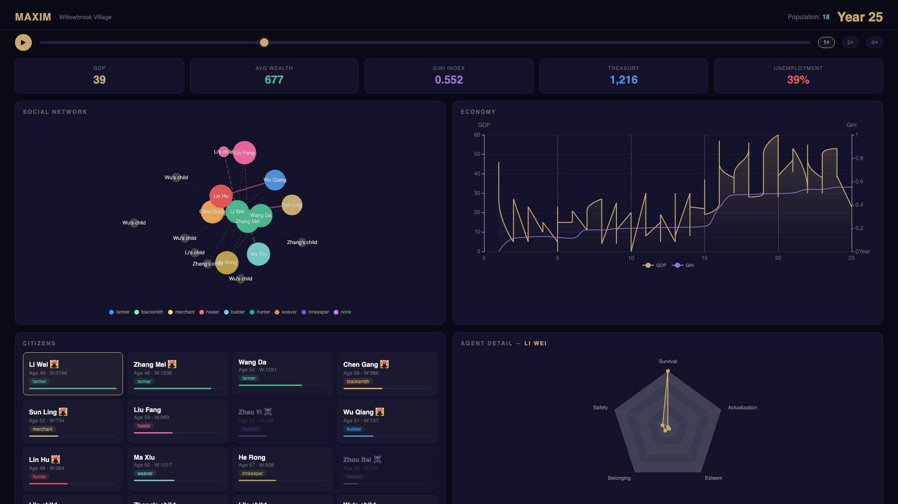

# Maxim — Multi-Agent Society Simulator with Economics

**The first open-source AI civilization engine with a working economy.**



Agents don't just chat — they work, earn, spend, trade, marry, have children, age, and die. Run 100 years of civilization history in 30 minutes. Watch economies boom and crash, alliances form and break, and cultures emerge from nothing but a handful of AI agents and a set of rules.

> **Maxim** = **M**ulti-**A**gent Society: **I**nteraction, e**X**change & **M**ulti-economy **M**odeler

## Quick Start

```bash
pip install -e .
maxim run examples/village.yaml --no-llm    # Rules-only (instant, free)
maxim run examples/village.yaml              # With DeepSeek LLM (richer narrative, ~$0.40)
```

Requires `DEEPSEEK_API_KEY` in environment for LLM mode.

## What Makes Maxim Different

| Feature | Stanford Generative Agents | AI Town (a16z) | Project Sid | **Maxim** |
|---------|--------------------------|-----------------|-------------|-----------|
| Working economy | No | No | Emergent roles only | **Supply/demand market, wages, tax, GDP, Gini** |
| Scale | 25 agents | ~10 agents | 500-1000 | **12+ (designed for 100+)** |
| Lifecycle | Static | Static | Static | **Birth, aging, marriage, death, inheritance** |
| Cost per run | $$$$ | $$ | $$$$ | **~$0.40 for 100 years** |
| Open source | Research artifact | MIT demo | Partial | **Apache-2.0, pip-installable** |

## Architecture

```
Agent Needs (Maslow)     → Rule-based intention selection (zero LLM cost)
     ↓
Game Master (LLM)        → Arbitrates all intentions per tick (1 DeepSeek call)
     ↓
Economy Engine           → Production, market clearing, wages, tax (pure math)
     ↓
Social System            → Relationships, marriage, births, deaths, teaching
     ↓
Chronicle                → Auto-detect milestones, export JSON for visualization
```

### Key Design Decisions

1. **Needs-driven behavior**: Agents have Maslow hierarchy (survival → safety → belonging → esteem → actualization). Wealth and relationships feed back into needs. Behavior emerges from needs, not from prompts.

2. **GM pattern** (inspired by [Concordia](https://github.com/google-deepmind/concordia)): One LLM call per tick arbitrates all agent intentions together. The GM considers traits, skills, economic constraints, and recent history. This keeps LLM costs at ~$0.40 per 100-year run.

3. **Real economy**: Supply/demand pricing, labor market, property, tax, treasury. GDP and Gini coefficient are calculated each tick. Economic crises and booms emerge naturally.

4. **Full lifecycle**: Agents age, marry (based on mutual affinity), have children (who inherit traits and grow up to work), and die (with wealth inheritance). The village is a living system.

## Scenario Format

Scenarios are YAML files defining the initial world state:

```yaml
name: "Willowbrook Village"
duration_years: 100
initial_currency: 150.0
tax_rate: 0.05

agents:
  - id: farmer_li
    name: "Li Wei"
    age: 25
    traits: [hardworking, cautious, kind]
    occupation: farmer
    skills: {farming: 0.7, cooking: 0.3}
  # ... more agents

goods:
  - name: food
    base_price: 5
    producers: [farmer, hunter]
  # ... more goods
```

See [`examples/village.yaml`](examples/village.yaml) for a complete 12-agent village.

## CLI

```bash
maxim run <scenario.yaml>                 # Full simulation with LLM
maxim run <scenario.yaml> --no-llm        # Rules only (fast, free)
maxim run <scenario.yaml> --export out.json  # Export chronicle
maxim run <scenario.yaml> --quiet         # Minimal output
maxim run <scenario.yaml> --verbose       # Debug logs
```

## Output

Each run produces:
- **Terminal UI**: Rich tables showing agent status, economy, milestones
- **Chronicle JSON**: Full event log, snapshots, GDP history (for visualization)
- **Milestone detection**: First trade, first marriage, population milestones, economic crises
- **Web Dashboard**: Interactive civilization dashboard with social graph, economy charts, and timeline playback

### Dashboard

```bash
maxim dashboard chronicle.json          # Open in browser
maxim run village.yaml --export out.json && maxim dashboard out.json
```

The dashboard shows:
- **Social network** (force-directed graph: node size = wealth, color = occupation, pink = marriage)
- **Economy charts** (GDP + Gini dual-axis, population over time)
- **Citizen cards** (click to see Maslow needs radar)
- **Event feed + milestones**
- **Time slider** with playback controls (1×/2×/4×)

## Cost

| Mode | Cost | Speed | Quality |
|------|------|-------|---------|
| `--no-llm` | Free | <1 second | Deterministic, less narrative |
| Default (DeepSeek) | ~$0.40 / 100 years | ~10-15 minutes | Rich narrative, emergent drama |

## Roadmap

- [x] **Dashboard**: Web UI with social graph, economy charts, timeline
- [ ] **Governance**: Voting, laws, community resource allocation
- [ ] **Variable speed**: 1sec=1day to 1sec=1year
- [ ] **Templates**: Coffee town, campus, design studio presets
- [ ] **Ome integration**: Swap rule-based agents for full Ome instances
- [ ] **SOAP integration**: Agents in 3D spatial environments

## Part of Omnity

Maxim is Layer 4 of the [Omnity](../../README.md) stack:

```
SOAP (spatial protocol) → Mindos (brain) → Ome (individual agent) → Maxim (society) → OmeTown (world)
```

## License

Apache-2.0 — same as the [Omnity monorepo](../../LICENSE).
